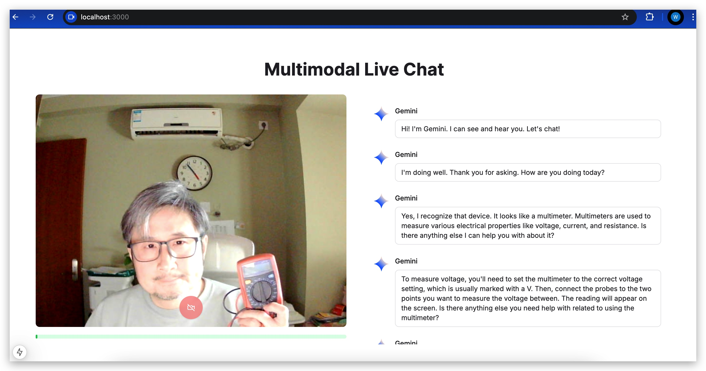
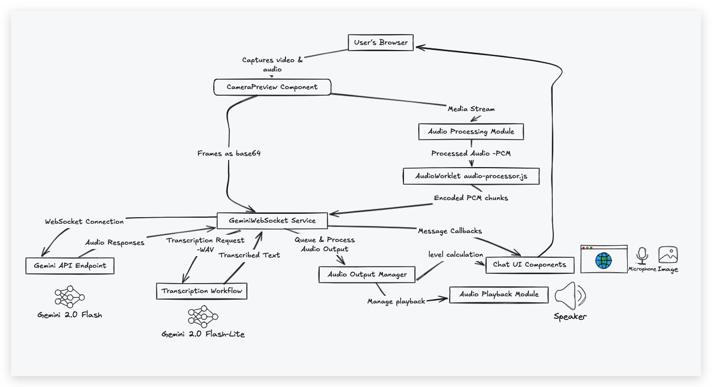

# Multimodal Realtime App with Gemini 2.0 by Next.js Framework

A demonstration project showing how to build a realtime multimodal application using Google's Gemini 2.0 API and Next.js. This app can process audio, video, and generate transcripts in realtime.



[Watch the Tutorial Video](https://youtu.be/YUfer6xyExY)

## Features

- Realtime audio/video(image) interaction with Gemini 2.0 Multimodal Live API
- Live transcription by Gemini 1.5/2.0 GenerativeAI API
- Built with Next.js for optimal performance

## Architecture



## Prerequisites

- Node.js 18+ installed
- API key for Gemini 2.0 Model

## Getting Started

1. Clone the repository
```bash
git clone https://github.com/yeyu2/gemini-nextjs.git
cd gemini-nextjs
```

2. Install dependencies
```bash
npm install
# or
yarn install
```

3. Set up environment variables
```bash
cp .env.example .env.local
```
Add your Gemini API key to `.env.local`:
```
GEMINI_API_KEY=your_api_key_here
```

4. Run the development server
```bash
npm run dev
# or
yarn dev
```

Open [http://localhost:3000](http://localhost:3000) with your browser to see the application.


